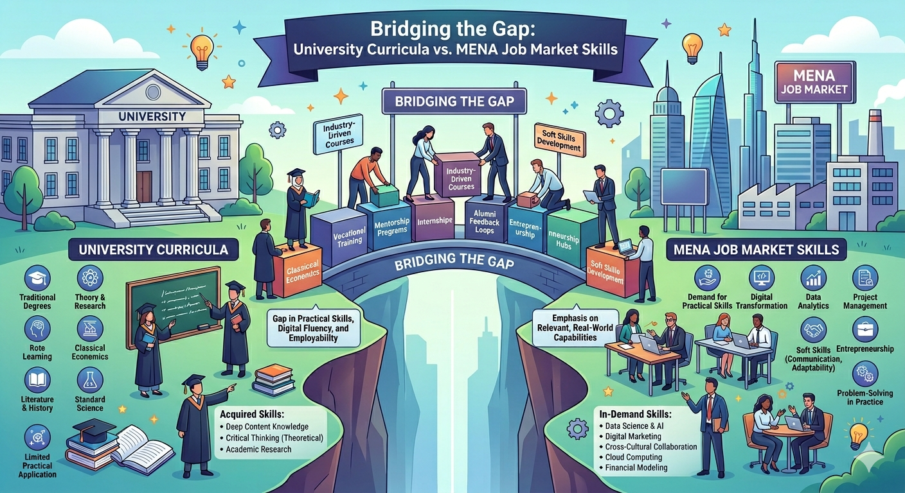
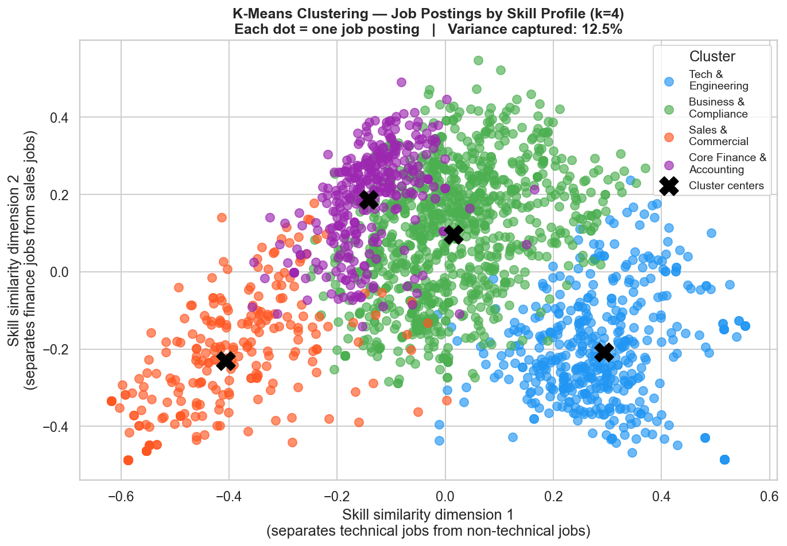

#                                                     🎓 Bridging the Gap
##                            University Curricula vs. MENA Job Market Skills


**A graduation project analyzing the skills gap between Jordanian university programs and real employer demands across the MENA region.**

---

## 📌 Project Overview

This project investigates whether the skills taught in Jordanian university curricula align with what employers actually require in the MENA job market. Using a combination of web scraping, LLM-powered skill extraction, machine learning models, and interactive dashboards, we quantify the gap and provide actionable, evidence-based recommendations for curriculum reform.

**Main Research Question:**
**To what extent do the skills taught in Jordanian university programs match the skills demanded by employers in the MENA job market?**

---

## 👥 Our Team

| Name | Role |
|------|-------|
| Sara Alzwiri | Job market data — scraping, cleaning, analysis, models |
| Yusra Almuhtaseb | University curriculum data — PDF extraction, LLM skill mapping, cleaning , power BI|

---
## 🔍 Our Project's Story

-After studying skills extracted from official course descriptones from three chosen Jordanian universities:

[The University of Petra](https://www.uop.edu.jo)

[Princess Sumaya University for Technology](https://psut.edu.jo)

[Al-Zaytoonah University of Jordan](https://www.zuj.edu.jo)


-across eight high-demand majors:

(Business Intelligence, Computer Science, Software Engineering, Data Science & AI, Cybersecurity, Accounting, Business Administration, and E-Marketing & Digital Marketing)

-then comapring them to 2k job listings scraped from [bayt.com](https://www.Bayt.com) across 4 MENA countries:

 UAE

KSA

EGYPT

JORDAN

### 🤖 **We found that:**

**1 — No university covers more than 22% of the skills employers actually ask for** — meaning at least **78% of job-required skills go undertaught** across every program we examined.

**2 — The most critically absent skills across all programs were: *Communication, Problem Solving, Data Analysis, Forecasting, CRM Systems, Python,* and *SQL*.**

> *Note: Coverage figures are based on dictionary-matched skills between the **308 distinct market skills** identified across 2,000 MENA job postings and the **1,145 curriculum skill records** collected from UOP, PSUT, and ZUJ. Only **68 skills** were matched, producing a Dictionary Gap of **78%**, with **240 market skills** remaining unmatched. Figures reflect skills explicitly stated in course syllabi and do not necessarily reflect the full scope of what is taught in practice.*

### 🤖 How the Job Market Actually Groups Itself

-To go beyond manual categorization, we used **K-Means Clustering (k=4)** to let the data speak for itself — grouping 2,000 job postings purely by their skill profiles, with no human labels.

-The model discovered **4 distinct skill clusters** that naturally emerged from the market:



 **The market itself drew this line. By clustering 2,000 job postings 
 purely by skill patterns, the algorithm confirmed what the gap analysis shows: 
 *technical and business roles demand fundamentally different skill sets*, 
 meaning universities cannot close the gap with a single shared curriculum fix.**

> Note:The clusters were **not predefined** — the algorithm found them on its own, which validates that these are real, distinct skill demands in the market.


---

## 🗃️ [Datasets we used](https://docs.google.com/spreadsheets/d/1huOD8G6YC7JgeGxmkFI5_vPosE0DIV-HyKe_-KiU6MY/edit?usp=sharing)

### University Curriculum Dataset
- **Source:** Official course syllabi and study-plan PDFs from UOP, PSUT, ZUJ
- **Extraction method:** Manual extraction then LLM-powered skill extraction with a structured prompt
- **Size:** 3,692 skill rows | 506 unique course codes across 3 universities
- **Fields:** University, Major, Course Code, Course Name, Skill

### Job Market Dataset
- **Source:** Bayt.com (scraped using Selenium)
- **Coverage:** 4 MENA countries — UAE, Saudi Arabia, Egypt, Jordan
- **Size:** 2,000 job postings across 8 sectors
- **Fields:** Job Title, Company, Location, Country, Sector, Skills, Experience Level, URL

---

## 🛠️ Tools & Technologies
**Everything we used to build this project — from scraping to visualization.**

| Category | Tools |
|----------|-------|
| Data Collection | Python, Selenium, BeautifulSoup |
| Data Processing | Pandas, OpenPyXL |
| Machine Learning | Scikit-learn (K-Means, Random Forest), MLxtend (Apriori) |
| Visualization | Matplotlib, Seaborn |
| BI Dashboard | Power BI |
| LLM Skill Extraction | Claude (Anthropic) |
| Documentation | Markdown |
| Version Control | GitHub |

---

## 🤖 Models Built

**Four analytical models, each answering a different question about the data.**
> 📄 [View full model documentation with results and charts](docs/documentation.md#advanced-analytics-and-ai-modeling)

| # | Model Type | Purpose |
|---|---|---|
| 1 | Frequency Analysis | Rank and compare the top 25 skills from university curricula vs. job market side by side |
| 2 | TF-IDF Vectorizer + K-Means Clustering | Convert skill lists into numerical vectors, then group job postings into 4 distinct skill profiles |
| 3 | Apriori Association Rule Mining | Discover which skills consistently co-occur in job postings and must be taught as a bundle |
---

## 📊 [Power BI Dashboard](https://app.powerbi.com/links/1OXa1o48J2?ctid=97e5760c-fa12-4aae-b4e4-31b43f04e79d&pbi_source=linkShare)

**An interactive 4-page dashboard summarizing the full findings.**

1. **Executive Overview** — KPI cards (Total Jobs, Market Skills, University Skill Records, Dictionary Matched Skills, Dictionary Gap %, Dictionary Missing Market Skills), Curriculum Skill Coverage by University column chart, Market Demand Share by Sector treemap, and Job Distribution by Country map

2. **Skills Gap Analysis** — Top Underrepresented Market Skills bar chart, Curriculum Coverage by Major & University clustered bar chart

3. **Job Evidence** — Full table of job postings (Job Title, Skill, Company, Location, Sector, Experience Level) with slicers for Location, Sector, Skill, and Experience Level

4. **Course Evidence** — Full table of university courses (Skill, University, Major, Course Code, Course Name) with slicers for Major, University, Skill, and Course Code data

---

## 📋 Requirements

```
pandas
openpyxl
selenium
beautifulsoup4
scikit-learn
mlxtend
matplotlib
seaborn
requests
```

---

## ⚠️ Limitations

- Curriculum skill coverage is based on explicit mentions in course descriptions
  only — actual classroom content may be broader than what is documented in
  official syllabi.

- Egypt and KSA job counts show low variance across sectors, likely because
  the scraper was capped at 10 result pages per keyword — meaning the dataset
  reflects a fixed sample ceiling rather than the true distribution of job
  postings across sectors in those markets.

- Job postings from Jordan were inherently limited in volume, as Bayt.com
  contains significantly fewer Jordanian listings compared to other MENA
  countries such as the UAE and Saudi Arabia. This reflects the platform's
  regional usage patterns rather than a data collection issue.

- The 78% skills gap figure may overstate the true misalignment due to
  terminology differences between academic and industry language. Skills
  that are conceptually equivalent but differently named — such as
  "Financial Statement Preparation" vs. "Financial Reporting" — are counted
  as unmatched. The synonym dictionary built for this project corrected for
  54 known cases, but residual mismatch likely remains.

- All data was collected during a fixed window (March–April 2026). Job market
  skill demand evolves continuously, and findings may not reflect current
  employer expectations beyond this period.

- The study covers three private Jordanian universities only. Public
  universities such as the University of Jordan and Yarmouk University are
  not represented, meaning findings cannot be generalized to the Jordanian
  higher education system as a whole.


---

## 📄 License

This project was developed for academic purposes as a graduation project at the University of Petra. Data collected from Bayt.com was used solely for non-commercial research.
