# Jordanian Universities vs. Job Market Skills Gap Analysis — MENA Region

**Authors**
- [Sara Alzwiri], [202210884]
- [Yusra Almuhtaseb], [202210396]

**Supervised by:** [DR.Husam Barham]

**Course:** 307498 – Graduation Project
**Semester:** Seconde Semester, 2025/2026
**Date:** [Submission Date]

---

## Table of Content

- [Abstract](#abstract)
- [Acknowledgment](#acknowledgment)
- [Business Intelligence Project Description and Objectives](#business-intelligence-project-description-and-objectives)
- [Data Research and Acquiring Effort](#data-research-and-acquiring-effort)
- [Data Description and Understanding](#data-description-and-understanding)
- [Data Primary Cleaning and Transformation](#data-primary-cleaning-and-transformation)
- [Data Visualization and Insights](#data-visualization-and-insights)
- [Dashboard Design & Business Insights](#dashboard-design--business-insights)
- [Advanced Analytics and AI Modeling](#advanced-analytics-and-ai-modeling)
- [Tools Research and Selection Effort](#tools-research-and-selection-effort)
- [Project Deployment Effort – Use Case](#project-deployment-effort--use-case)
- [Results](#results)
- [References](#references)

---

## Abstract

Higher education institutions in Jordan face a growing challenge: ensuring that graduates are equipped with the skills that employers in the MENA region actually demand. This project investigates the skills gap between what three Jordanian universities — the University of Petra (UOP), Princess Sumaya University for Technology (PSUT), and Al-Zaytoonah University of Jordan (ZUJ) — teach across eight academic majors(in fields between IT and Business), and what the MENA job market requires. By systematically collecting and comparing 2,000 job postings from Bayt.com across four MENA countries (UAE, Saudi Arabia, Egypt, Jordan) with 1,145 university course–skill records, this project surfaces concrete, data-driven evidence of where curriculum falls short of market expectations.

To achieve this, we built a custom Python web scraper using Selenium to collect live job postings from Bayt.com, extracted required skills from full job descriptions, and manually compiled curriculum skill data from official university course catalogs. The two datasets were cleaned, normalized, and compared to compute a Skill DNA Match percentage per university–major combination. Advanced analytics techniques were then applied: K-Means clustering to identify distinct job profiles in the market, Apriori association rule mining to discover which skills consistently co-occur in postings, and a lift-score model to identify skills that are uniquely distinctive per sector. All findings were visualized through Python charts and an interactive Power BI dashboard.

This analysis reveals critical, systematic gaps across all three universities. AI/Machine Learning (309 job postings) and Cloud Computing are demanded across virtually all sectors yet are severely underrepresented in curricula. ERP systems, Agile/Scrum, and CI/CD appear in a limited number of relevant courses despite high employer demand. PSUT achieves the strongest alignment in Computer Science and Cybersecurity, while Al-Zaytoonah leads in curriculum breadth and Accounting coverage. University of Petra demonstrates stronger performance in Business Intelligence, Data Science & AI, and Marketing. No university achieves a strong skill match across all eight majors simultaneously. These findings provide actionable, evidence-based recommendations for curriculum reform at Jordanian universities to better prepare graduates for the MENA job market.

---

## Acknowledgment

We would like to express our sincere gratitude to our supervisors, for there continuous guidance, constructive feedback, and support throughout the duration of this project. There expertise in Business Intelligence and data analysis greatly shaped our analytical approach and final outcomes.

We also thank the faculty of Faculty of Administrative & Financial Sciences at the University of Petra for providing us with the academic foundation and resources necessary to undertake a project of this scope. Special thanks to the university administration offices of UOP, PSUT, and Al-Zaytoonah University for making their curriculum materials publicly accessible, which formed an essential part of our dataset.

Finally, we acknowledge Bayt.com for maintaining an open and comprehensive job listing platform for the MENA region, without which the job market side of this analysis would not have been possible.

---

## Business Intelligence Project Description and Objectives

### What is this project about?

This project is a Business Intelligence study that measures the **skills gap** between what Jordanian universities teach and what MENA employers demand. We collected 2,000 real job postings across eight professional sectors and compared the skills they require against the skills taught across 506 courses at three Jordanian universities. The output is a data-driven skills gap report delivered through Python-generated analytical charts and an interactive Power BI dashboard, enabling universities and students to see — at a major level — exactly which skills are missing and how critical each gap is.

### What industry or business domain does it address?

This project sits at the intersection of **higher education** and the **MENA labor market**. It is directly relevant to:
- University curriculum committees evaluating and updating program content.
- Students choosing electives or planning self-study to improve employability.
- Career advisors guiding graduates toward in-demand competencies.
- Employers in the UAE, Saudi Arabia, Egypt, and Jordan who recruit Jordanian graduates.

### How will it help the industry/business?

Rather than relying on subjective observations about graduate readiness, this project provides **quantified, sector-by-sector evidence** of where the gaps lie. Universities can use this data to prioritize curriculum updates. Students can use it to identify which skills to self-develop. Employers can better understand what to expect from Jordanian graduates and where to invest in onboarding training.

### What specific business problems are we solving?

1. **No systematic measurement of curriculum–market alignment:** Universities currently have no structured, data-driven way to compare what they teach against live employer demand. We solve this with a repeatable, scalable comparison pipeline.

2. **Students lack visibility into skill gaps:** Graduates often discover skill deficiencies only after entering the job market. Our dashboard gives students and advisors a clear, major-specific picture of what employers expect.

3. **Critical emerging skills are absent from curricula:** Technologies like AI/ML, Cloud Computing, and Power BI are transforming every sector, yet they appear minimally in current syllabi. We quantify this absence with hard numbers.

4. **No MENA-specific benchmark for Jordanian universities:** Existing studies are global or generic. Our dataset is specific to UAE, Saudi Arabia, Egypt, and Jordan — the most relevant markets for Jordanian graduates.

---

## Data Research and Acquiring Effort

### What data did we search for and why?
Our study focused on collecting academic curriculum data from selected private Jordanian universities in order to analyze the skills provided through university courses and academic programs. The main objective was to understand how well university curricula align with labor market skill requirements.

The study focused on two main academic areas: Information Technology and Business.

**1- Therefore,for the first dataset(university skills)** the selected programs were:

•	Business Intelligence

•	Computer Science

•	Software Engineering

•	Data Science & AI

•	Cybersecurity

•	Accounting

•	Business Administration

•	Marketing

These programs were selected because they represent a combination of technical, analytical, business, accounting, marketing, security, programming, and data-related fields. This made them suitable for analyzing the relationship between academic skill coverage and job-market expectations.

At the beginning of the project, four universities were considered for the study:**University of Petra, Al-Zaytoonah University of Jordan, Princess Sumaya University for Technology, and Al Hussein Technical University**. During the first stage, the study focused mainly on IT-related programs, which made Al Hussein Technical University a relevant option.

However, after expanding the study scope to include both **IT and Business programs**, it became clear that Al Hussein Technical University did not provide the required business-related programs within the selected scope. As a result, it was excluded in order to maintain fairness and consistency across the selected universities.

After that, the **German Jordanian University** was considered as a possible fourth university because it includes a Business Intelligence-related program, which is relevant to the study. However, the main challenge was the availability of complete study plans and course descriptions for all eight selected programs. Although some of its documents were available in English, the incomplete coverage of the required programs made the comparison less balanced.

The **Middle East University** was also considered because it offers programs related to Business Intelligence and similar fields. However, collecting data from the university website was difficult. Some programs did not provide detailed course descriptions, and in several cases, only study plans or course lists were available. Since course descriptions are more accurate for extracting skills, the university was excluded from the final dataset.

Based on these challenges, the study was finalized using three private Jordanian universities:

•	University of Petra

•	Al-Zaytoonah University of Jordan

•	Princess Sumaya University for Technology

These universities were selected because they are relatively similar in terms of academic program offerings within the study scope, which allows a fairer and more meaningful comparison. University of Petra was also included because it is our university, making it important to evaluate its academic skill coverage in comparison with other private Jordanian universities.

**2-For the second dataset (MENA job market skills)** 
The focus was on job listings related to the eight academic programs selected for the study, covering both IT and Business fields.

Initially, the data collection effort focused on the **Jordanian job market** by targeting three popular local recruitment platforms: Bayt.com, Akhtaboot.com, and Kalamantina.com. However, after analyzing the available listings, it became clear that the Jordanian market alone did not provide a sufficient number of job postings across all eight sectors to produce statistically meaningful results. The dataset collected from Jordan-only sources was limited to approximately 300 unique records, which was not large enough to represent the full range of job roles and required skills across all programs.

As a result, the scope was expanded to cover the broader **MENA region**, specifically **Jordan, the United Arab Emirates, Saudi Arabia, and Egypt**. This decision was academically justified because Jordanian graduates typically compete in the regional job market, not just locally. Major employers such as Aramex, Arab Bank, Zain, and Amazon MENA operate across the region and apply consistent skill requirements regardless of the country. Expanding to MENA therefore made the dataset more representative without changing the study's core purpose.

Following the expansion to the MENA scope, the data collection was redesigned to focus on one primary platform: **Bayt.com** . this platform was selected because it consistently returned usable, structured job listings, while other platforms either blocked automated access or returned insufficient results. The scraping process was conducted using a **custom Python script built with Selenium**, which navigated the platform, performed searches based on the eight target sectors, and collected structured data for each job listing.

By comparing both datasets, we can compute exactly which skills employers need that universities are not covering — and how severe each gap is.

### How did we acquire it?

#### University Curriculum Data — Manual Collection

The university data was collected from official university sources, mainly PDF files published on the universities’ official websites. The collected documents included study plans, course plans, and course descriptions, depending on what was available for each program.

The data was collected from the following universities:

•	University of Petra

•	Princess Sumaya University for Technology

•	Al-Zaytoonah University of Jordan

The extracted information included:

•	University name

•	Major or program category

•	Course code

•	Course name

•	Skills extracted from course descriptions

Not all documents had the same structure. Some sources were complete study plans, while others were course descriptions only. Therefore, each document was treated according to its actual type, and no source was described as a full study plan unless the official document clearly supported that. This was important to avoid overstating the evidence or misclassifying a course-description document as a complete study plan.
______________________________________________________________________________________________________
**Data Collection Challenges**

Several challenges were faced during the data collection stage.

*First*, not all universities provided complete and detailed course descriptions for all programs. Some documents included only course names without detailed descriptions, which limited the ability to extract accurate skills.

*Second*, some PDF files were available only in Arabic. Even when changing the website language, some documents remained in Arabic. 

*Third*, some PDF files were not clearly structured. For example, some University of Petra documents had unclear titles or very short course descriptions, which made skill extraction more difficult.

*Fourth*, the number of collected PDF files was relatively large, approximately 27 PDF files across the three universities. To maintain extraction accuracy and source traceability, the PDF files were organized and processed by university instead of being handled as one combined file.

*Fifth*, the files were initially merged into one PDF file using **iLovePDF**. However, this made it harder to track the source of each course, especially when some files did not contain clear titles. Therefore, the merged file was later separated into three main PDF files, one for each university: UOP, ZUJ, and PSUT.

_____________________________________________________________________________________________________

Supporting tools were used during the data preparation stage to organize and process the collected university documents, but they were not used to create new data.

[**iLovePDF**](www.ilovepdf.com) was used to convert some PDF files into readable text and to merge or split PDF files when needed.

**Claude** was used as an **LLM-assisted extraction tool** to support the structured extraction of skills from official course descriptions. Its role was limited to reading the provided course description text and extracting only the skills, topics, or competencies that were explicitly mentioned or directly supported by the course title when the description was missing.

The LLM was instructed not to invent skills, add unsupported technologies, or include generic phrases. Therefore, the AI tool was used as a parsing and organization assistant, not as a source for generating new information.

To keep the extraction process consistent, the following structured **prompt** was used to guide the LLM-assisted extraction process.

You are an academic curriculum-to-skills extraction assistant.
Task:
Extract practical skills acquired by students from university course descriptions.

Strict rules:
1. Use the course description as the primary source.
2. If the description is missing, infer only from the course title and do not add technologies/tools that are not directly implied.
3. Extract measurable technical, analytical, business, accounting, marketing, security, programming, data, and professional skills.
4. Do not invent skills or add generic phrases.
5. Normalize synonymous skills into one standard form.
6. Use requested abbreviations when applicable: BI, AI, ML, SQL, OOP, VBA, ERP, CRM, IFRS.
7. Remove duplicated skills.
8. Return one row per course, and place all skills in one comma-separated cell.
9. Keep university, major, course code, and course name unchanged.
10. Output must be suitable for Excel filtering and later comparison with job-market data.

Output columns:
University, Major, Course Code, Course Name, Cleaned Skills

#### Job Market Data — Web Scraping

We built a custom Python scraper using **Selenium WebDriver** to collect job listings from [Bayt.com](https://www.bayt.com), the MENA region's largest job portal. The scraper operated in three phases:

**Phase 1 — Collect Listings:** The scraper searched Bayt.com for 78 job-title keywords (e.g., `"data scientist"`, `"accountant"`, `"cybersecurity analyst"`) across 4 countries and up to 10 result pages each, collecting the job title, company, location, Sector, date posted, and URL of every listing card.

**Phase 2 — Scrape Full Descriptions:** Each job URL was opened individually and the full job description text was extracted — this text contains the actual skill requirements employers list.

**Phase 3 — Export to Excel:** All records were saved to a formatted Excel file. A checkpoint save occurred every 100 records to protect against interruptions.

To avoid detection, the scraper used random delays between requests (1.5–3.0 seconds), a real-browser User-Agent string, and suppressed Selenium's automation flags.

The collected fields for each job record included: job title, company name, location, sector, source platform, experience level, date posted, URL, and full job description. After collection and deduplication, the final dataset contained approximately **2,000 unique job postings** representing a snapshot of the MENA regional job market at the time of data collection.

**(Skills Extraction from Job Descriptions part)**Unlike structured data fields such as job title or location, skills were not listed in a consistent format across job postings. Each posting contained a block of free text in the job description, where required skills were mentioned in various ways, sometimes directly and sometimes implied within the context. Manual extraction of skills from 2,000 job descriptions was not feasible within the project timeline and would have introduced inconsistency.

To address this, an **AI-based extraction pipeline** was applied to the job description text after scraping was complete. The pipeline used Claude, a **large language model** developed by Anthropic, to read each job description and identify the skills mentioned or implied in it. The extraction followed a structured process: the model first identified all relevant skills from the text, and compiled a clean, comma-separated list of skills for each job record stored in the Skills column of the dataset.

This approach resulted in 302 unique skills being identified across the full dataset, with an average of approximately 7.7 skills per job posting. The most frequently required skills across all sectors included communication, problem solving, data analysis, collaboration, and Microsoft Excel, while sector-specific technical skills varied significantly across programs.

### Links to raw data sources

| Source | URL |
|---|---|
| Bayt.com — UAE | https://www.bayt.com/en/united-arab-emirates/jobs/ |
| Bayt.com — Saudi Arabia | https://www.bayt.com/en/saudi-arabia/jobs/ |
| Bayt.com — Egypt | https://www.bayt.com/en/egypt/jobs/ |
| Bayt.com — Jordan | https://www.bayt.com/en/jordan/jobs/ |
| University of Petra | https://www.uop.edu.jo |
| PSUT | https://www.psut.edu.jo |
| Al-Zaytoonah University | https://www.zuj.edu.jo |

### Brief description of each data source

**Bayt.com** is the MENA region's leading online job portal, founded in 2000 and headquartered in Dubai. It hosts millions of job listings from employers across more than 20 countries, with each listing containing structured information including job title, company name, location, and a full description of required qualifications and skills. Bayt.com was selected as the primary data source for this study because it covers all four target countries within a single platform, is publicly accessible, and is the most widely used recruitment platform by both employers and job seekers across the region.

**University of Petra (UOP)** is a private Jordanian university and the home institution of this study's research team. It was included both as a subject of evaluation and as a reference point for comparing academic skill coverage across Jordanian universities. Its curriculum data in this study covers 8 academic programs, 209 courses, and 269 skill-course mappings.

**Princess Sumaya University for Technology (PSUT)** is a private Jordanian university with a strong focus on technology and applied sciences. Given its specialization, it was considered a particularly relevant institution for evaluating IT-related program alignment with labor market demands. Its curriculum data covers 7 academic programs, 147 courses, and 164 skill-course mappings.

**Al-Zaytoonah University of Jordan (ZUJ)** is a private Jordanian university offering a broad range of academic programs across both technical and business disciplines. It was selected for its balanced coverage of the study's target programs and its comparable institutional profile to the other two universities. Its curriculum data covers 8 academic programs, 150 courses, and 122 skill-course mappings.

---

## Data Description and Understanding

### Data Dictionary

#### University Dataset Fields 

| Field | Type | Description | Why It Matters |
|---|---|---|---|
| `University` | Text | Name of the university (Petra / PSUT / Al-Zaytoonah) | Enables university-level comparison |
| `Major` | Text | Academic major (e.g., "Accounting", "Data Science & AI") | Links curriculum to the corresponding job sector |
| `Course Code` | Text | Official course code (e.g., `303101`) | Unique course identifier |
| `Course Name` | Text | Official course title | Human-readable course identifier |
| `Skill` | Text | A specific competency taught in this course — one row per skill | **Primary analysis variable** — compared against job market demand |


#### Job Dataset Fields 

| Field | Type | Description | Why It Matters |
|---|---|---|---|
| `Job Title` | Text | Full title of the job posting | Used to infer experience level; primary identifier |
| `Company` | Text | Name of the hiring company | job identifier |
| `Location` | Text | Country of the job (UAE / KSA / Egypt / Jordan) | Enables country-level demand comparison |
| `Sector` | Categorical | Academic sector (e.g., "Accounting", "Data Science & AI") | Primary grouping variable for gap analysis |
| `Source` | Text | Platform scraped ("Bayt") | Data provenance tracking |
| `Experience Level` | Categorical | Junior / Mid-level / Senior / Managerial — inferred from title | Enables analysis by seniority level |
| `Date Posted` | Date (YYYY-MM-DD) | Normalized posting date | verify recency of job postings and ensure the dataset reflects a current snapshot of the job market |
| `Skills` | Comma-separated list | Required skills extracted from the job description | **Primary analysis variable** — compared against university curriculum |
| `URL` | URL | Direct link to the original Bayt.com listing | Data traceability and verification |
| `Job Description` | Long text | Full raw job description text | Source material for skills extraction |

---

### Exploratory Data Analysis (EDA)

#### Data Distribution

**1-Job postings by sector:**

| Sector | Total Jobs | Avg Skills/Job | 
|---|---|---|
| Data Science | 348 | 7.3 |
| Business Administration | 339 | 5.2 | 
| Accounting | 240 | 11.4 |     
| Cybersecurity | 238 | 6.9 | 
| E-Marketing & Digital | 232 | 5.4 | 
| Business Intelligence | 205 | 7.0 | 
| Software Engineering | 203 | 7.8 | 
| Computer Science | 195 | 9.8 | 
*This table summarizes the job market dataset by sector. It shows the total number of job postings collected for each sector, the average number of skills required per job.
**2-Job postings by country:**

| Country | Jobs | % of Total |
|---|---|---|
| UAE | 847 | 42.4% |
| Saudi Arabia | 500 | 25.0% |
| Egypt | 500 | 25.0% |
| Jordan | 153 | 7.7% |
*The dataset covers four MENA countries: UAE, Saudi Arabia, Egypt, and Jordan. UAE has the largest share of collected job postings.*

**3-University curriculum coverage:**

| University | Unique Skills | Courses | 
|---|---|---|
| Al-Zaytoonah (ZUJ) | 122 | 150| 
| PSUT | 164 |147 | 
| University of Petra (UOP) | 269 | 209 |
*This table describes the university curriculum dataset by showing the number of courses and distinct extracted skills for each university.* 

**4-Skills and Courses by Major**

| Major | Petra Skills | PSUT Skills | ZUJ Skills | Petra Courses | PSUT Courses | ZUJ Courses | Total Skills | Total Courses |
|---|---|---|---|---|---|---|---|---|
| Accounting | 96 | 34 | 39 | 29 | 18 | 16 | 169 | 63 |
| Business Administration | 114 | 68 | 48 | 42 | 44 | 48 | 230 | 134 |
| Business Intelligence | 128 | 0 | 25 | 36 | 0 | 24 | 153 | 60 |
| Computer Science | 8 | 34 | 28 | 3 | 15 | 28 | 70 | 46 |
| Cybersecurity | 42 | 19 | 22 | 18 | 9 | 20 | 83 | 47 |
| Data Science & AI | 100 | 24 | 8 | 25 | 21 | 8 | 132 | 54 |
| Marketing | 158 | 41 | 4 | 32 | 21 | 4 | 203 | 57 |
| SW Engineering | 64 | 39 | 2 | 24 | 19 | 2 | 105 | 45 |
| **TOTALS** | **710** | **259** | **176** | **209** | **147** | **150** | **1,145** | **506** |
*-PSUT does not offer a Business Intelligence program, resulting in 0 skills and courses for that major.*


#### Patterns Discovered

The most striking pattern is a **systematic naming gap** between curricula and market: university curricula use long academic descriptors (e.g., "Financial Statement Preparation (IAS)", "Cost-Volume-Profit Analysis") while job postings use short industry labels (e.g., "Financial Reporting", "Audit Support"). The underlying competency may overlap, but the terminology mismatch causes zero direct matches — understating actual alignment. This pattern holds across all eight sectors.

A second pattern is **tool-specific demand** with zero curriculum presence: employers consistently require named tools that appear nowhere in any university's skill list. Microsoft Excel appears in 270 job postings, Microsoft Office in 174, ERP Systems in 162, SAP in 108 — none of these appear directly in any curriculum. Meanwhile, universities teach the conceptual equivalent (spreadsheet analysis, enterprise systems) without naming the tool.

A third pattern is **consistent skill co-occurrence**: market skills cluster tightly. The top co-occurring pair, Collaboration + Communication, appears together in 490 job postings. Budgeting + Forecasting co-occur in 132 postings, and Audit Support + Budgeting in 116. This means a graduate missing one skill in a cluster is effectively missing the entire profile employers expect simultaneously.

#### Correlations and Relationships Found

- **PSUT holds the highest tech curriculum volume:** Computer Science (34 unique skills), Cybersecurity (19), Data Science & AI (24) — the densest technical programs among all three universities
- **University of Petra has the broadest overall coverage:** 710 skill entries across 209 courses, leading in Business Intelligence (128 skills), Marketing (158), and Data Science & AI (100)
- **Accounting has the highest skill density per posting** at 11.3 skills/job — employers in this sector expect the widest simultaneous competency profile
- **UAE dominance:** 847 of 2,000 postings (42%) originate from the UAE, making it the primary reference market for Jordanian graduates

#### Insights Relevant to Project Objectives

🔴 **Critical:** Cloud Computing (AWS + Azure = 241 combined postings) and ERP Systems (SAP + Oracle + Microsoft Dynamics + ERP = 427 combined postings) are among the highest-demanded skill clusters — yet none appear directly in any university curriculum by their market name.

🟠 **High:** Agile/Scrum (164 postings) and DevOps tools including CI/CD, Docker, and Kubernetes (268 combined postings) appear consistently across tech sectors but have no direct equivalent course in any of the three universities.

🟡 **Moderate:** Python (150 postings) and SQL (121 postings) are the only two high-demand technical tools that appear directly in university curricula — making them the strongest points of verified alignment between academia and market.

📌 **Structural finding:** No university achieves a strong skill match in any major across all three institutions. Curriculum gaps are systematic across all majors — not confined to any single program.
---

## Data Preparation and Cleaning

### University Dataset Preparation

The university curriculum dataset was built from official course-description and study-plan documents collected from three private Jordanian universities: University of Petra (UOP), Princess Sumaya University for Technology (PSUT), and Al-Zaytoonah University of Jordan (ZUJ).

**Source documents** included study plans, course plans, course descriptions, and program description files. Each document was treated according to its actual structure, and no document was described as a full study plan unless clearly supported by the source.

**Skill extraction** was performed using an LLM-assisted process. The LLM was used as a parsing and organization assistant — not as a source of new information. Its role was to read the provided course descriptions and extract only skills, topics, or competencies that were explicitly stated or directly supported by the course title. The extraction followed strict rules: no invented skills, no unsupported tools, and no additions beyond what the course content described.

The extracted data was structured into a table with five fields: University, Major, Course Code, Course Name, and Skill. Each row represents one extracted skill linked to one course, meaning a single course may appear in multiple rows if more than one skill was extracted from its description.

**Cleaning steps applied:**

1. Removed unsupported or overly generic extracted phrases
2. Standardized major names into consistent analytical categories
3. Kept course codes as text to preserve leading zeros
4. Removed exact duplicate rows using the full five-field context (University + Major + Course Code + Course Name + Skill) — not on the Skill column alone, since the same skill can validly appear across different courses and universities
5. Normalized skill names by removing extra spaces, hidden spaces, and standardizing text case — reducing raw distinct skills from 370 to **369 normalized distinct skills**
6. Checked for missing values across all key fields

**Final cleaned university dataset counts:**

| Metric | Count |
|---|---:|
| Universities | 3 |
| Major Categories | 8 |
| Total Distinct Courses | 506 |
| Total Skill Records | 1,145 |
| Normalized Distinct Skills | 369 |
| Missing Values | 0 |
| Exact Duplicate Rows | 0 |


> **Important:** A higher number of skill records does not indicate higher academic quality. It reflects the level of detail available in the collected course description documents.

### Job Dataset Preparation

The job dataset was collected from Bayt.com and stored in Excel, where each row represented one job posting. The `Skills` column contained multiple skills in a single cell, separated by commas. Since the project analyzes skills individually, the dataset required transformation in two stages: first through Python during data collection, then through Power Query in Power BI.

**Stage 1 — Python Cleaning (during data collection):**

**Step 1 — Standardizing Country Names:**

Country names were standardized for consistency. For example, `Saudi Arabia` and `KSA` were unified to a single label to ensure consistent grouping across the dataset.

**Step 2 — Handling Missing Values:**

| Field | Missing Values | Action |
|---|---|---|
| Skill | 0 | No action required |
| Job Title | 0 | No action required |
| Company | 17 | Kept as N/A — company name is not essential for skill analysis |

**Step 3 — Data Type Conversions:**

`Date Posted` was cleaned from raw Bayt.com text to ISO format `YYYY-MM-DD`:

| Raw Input | Result |
|---|---|
| `"3 days ago"` | Today minus 3 days |
| `"2 weeks ago"` | Today minus 14 days |
| `"April 14 2026"` | `2026-04-14` |
| Unparseable | Today's date (fallback) |

`Experience Level` was converted from free-text job titles to a categorical field:

| Title Keywords | Assigned Level |
|---|---|
| senior, lead, head of, principal | Senior |
| junior, graduate, intern, fresh | Junior |
| manager, director, vp, chief, ceo | Managerial |
| *(anything else)* | Mid-level |

**Step 4 — Deduplication:**

After scraping, the same job posting could appear under multiple search keywords. URL-based deduplication ensured each posting was counted exactly once:

```python
df.drop_duplicates(subset=["URL"], inplace=True)
```

---

**Stage 2 — Power Query Transformation (in Power BI):**

1. Removed the dataset title row
2. Promoted the correct header row
3. Assigned correct data types to each column
4. Selected only the required columns and removed long text fields such as `Job Description`
5. Trimmed and cleaned text columns to remove extra spaces and hidden characters
6. Split the `Skills` column by comma into rows — converting one row per job posting into one row per job-skill record
7. Renamed `Skills` to `JobSkill` to reflect that each row now contains one skill
8. Trimmed and cleaned `JobSkill` again after splitting to remove leading spaces
9. Removed empty or null skill rows
10. Created a `JobSkillKey` column as a normalized duplicate of `JobSkill` — applying lowercase, trim, and clean — to improve matching accuracy across Power BI calculations

**Final cleaned job dataset structure:**

| Field | Description |
|---|---|
| `Job Title` | The job posting title |
| `Company` | The hiring company |
| `Location` | The job country or location |
| `Sector` | The job sector |
| `Experience Level` | Junior, Mid-level, Senior, or Managerial |
| `Date Posted` | The job posting date |
| `URL` | Link to the original job posting |
| `JobSkill` | The original readable skill name |
| `JobSkillKey` | The normalized skill name used for matching and analysis |

> **Note:** Repeated skills across different job postings were intentionally kept because they represent real market demand. If `Microsoft Excel` appears in 270 job postings, this repetition is meaningful and reflects how many employers require this skill.


## Data Visualization and Insights
**uni dataset visualization**

**Chart 1: Skill Entries by Major**

*This clustered column chart compares the number of extracted curriculum skill records across majors and universities. It helps identify which universities have stronger documented skill coverage in specific majors.*

**Insight:**
*University of Petra (UOP) shows the highest skill records in most majors, particularly in Marketing (158), Business Intelligence (128), Business Administration (114), and Data Science & AI (100). PSUT shows stronger coverage in Computer Science (34) and Software Engineering (39). Al-Zaytoonah shows comparable coverage in Computer Science (28) and Cybersecurity (22).*

**Chart 2: Courses by Major**

*This chart shows the number of distinct courses offered by each university for every major. It helps explain whether high skill record counts are related to a larger number of courses.*

**Insight:**
*Al-Zaytoonah leads in Business Administration course count (48 courses), while UOP leads in Business Intelligence (36 courses) and Marketing (32 courses). PSUT has no Business Intelligence major in this dataset. Higher skill records do not always reflect more courses — they may also reflect more detailed course descriptions.*


**job dataset visualization**

**Chart 3: Experience Level Distribution by Country**
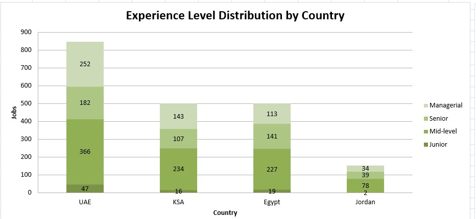
*This chart visualizes how job opportunities are distributed across experience levels in each country.*

**Insight**
:*UAE has the largest number of job postings across experience levels, which makes it the strongest contributor to the job market dataset.*

**Chart 4: Jobs Distribution by Country**
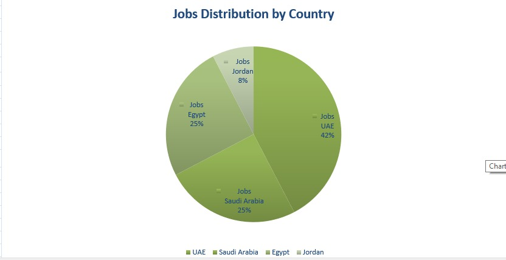
*This pie chart shows the percentage contribution of each country to the total job postings.*

**Insight**
:*UAE represents the largest share of the dataset, while Jordan has the smallest share.*

**Chart 5: Avg Skills / Job by Sector**
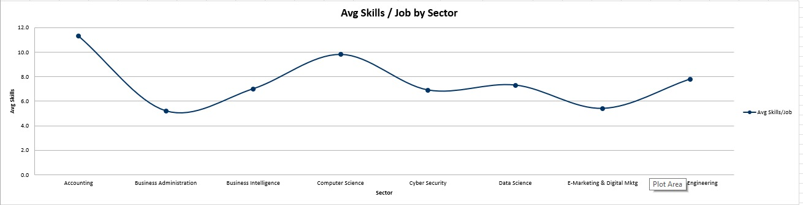
*This chart compares the average number of required skills per job across sectors.*

**Insight**
:*Accounting and Computer Science require higher average skills per job, which may indicate more complex or detailed job requirements.*


---

## Dashboard Design & Business Insights

 The Power BI dashboard was designed to analyze the relationship between university curriculum skill coverage and MENA job market skill requirements.
 
The dashboard includes four main pages:
 
1. **Executive Overview**
2. **Skills Gap Analysis**
3. **Job Evidence**
4. **Course Evidence**
 
The dashboard answers the main project question:
 
> **How well do university curricula align with job market skill requirements?**
 
It combines high-level KPIs, interactive filters, visual comparisons, and evidence tables to support the skill gap analysis in a clear and traceable way.
 
---
# Dashboard Components and Insights
 
---
 
# Page 1: Executive Overview
 
The Executive Overview page provides a high-level summary of the project. It gives the viewer a quick understanding of the dataset size, market skills, university skills, matched skills, and gap percentage.
 
---
 
## Component 1: KPI Cards — Main Dashboard Indicators

 
### Description
 
The KPI cards show the main numerical summary of the dashboard:

 
- **Total Jobs:** 2K
- **Overall Market Skills:** 186
- **Overall Distinct University Skills:** 3K
- **Gap %:** 86%
- **Matched Skills:** 26
 
These cards provide a quick overview of the job market dataset, university curriculum dataset, and the level of matching between them.
 
### Insight Derived
 
The KPIs show that the job dataset contains **2,000 job postings** and **186 distinct market skills**, while the university dataset contains around **3,000 distinct curriculum skills**.
 
However, only **26 skills are matched**, resulting in a high **Gap % of 86%**.
 
This is important because it shows that having many university skills does not automatically mean strong market alignment. The key issue is whether the skills taught in curricula match the skills requested by employers.
 
---
 
## Component 2: Filters / Slicers

 
### Description
 
The Executive Overview page includes interactive filters for:
 
- **Location**
- **University**
- **Sector**  *filter for job dataset*
- **Major**   *filter for uni dataset*
 
These filters allow users to narrow the analysis based on country, university, job sector, or academic major.
 
### Insight Derived
 
The filters make the dashboard interactive and allow more focused analysis. For example, a user can select one university or one sector to see how the results change.
 
This helps decision-makers explore specific curriculum-market relationships instead of only looking at the overall results.
 
---
 
## Chart 1: Job Distribution by Country
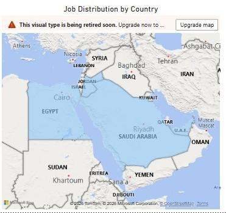
 
### Description
 
This map shows the geographic distribution of job postings across the selected MENA countries. The map highlights the countries included in the job market dataset, such as:
 
- Jordan
- Saudi Arabia
- UAE
- Egypt
 
### Insight Derived
 
-The chart helps identify where the collected job demand is geographically concentrated.
 
*This is important because skill demand may differ by country, and curriculum alignment should consider the regional job market, not only the local market.*
 
This chart supports the business question:
 
> **Which countries are represented in the job market dataset?**
 
---
 
## Chart 2: Curriculum Skill Coverage by University
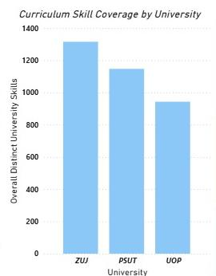
 
### Description
 
This bar chart compares the overall distinct university skills across the three universities:
 
- **ZUJ**
- **PSUT**
- **UOP**
 
The chart shows which university has the highest curriculum skill coverage based on the extracted curriculum skills.
 
### Insight Derived
 
-The chart shows that **ZUJ has the highest curriculum skill coverage**, followed by **PSUT**, then **UOP**.
 
-This indicates that ZUJ has the broadest extracted skill coverage in the collected curriculum documents.
 
*This is important because it helps compare academic-side skill coverage across universities. However, this chart measures curriculum coverage only.The curriculum skill coverage are based solely on what was explicitly stated in each university's course syllabi and subject descriptions, and do not necessarily reflect the full scope of skills taught in practice(It does not measure teaching quality, university ranking, student performance, or graduate employability.)*
 
 This chart supports the business question:
 
> **Which university has the broadest curriculum skill coverage based on its course syllabi?**
---
 
## Chart 3: Market Demand Share by Sector
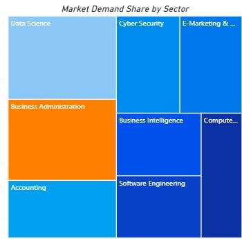
 
### Description
 
This treemap shows the distribution of job market demand by sector. The sectors shown include:
 
- Data Science
- Business Administration
- Accounting
- Cyber Security
- E-Marketing & Digital Marketing
- Business Intelligence
- Software Engineering
- Computer Science
 
The size of each block represents the sector’s share of job market demand in the dataset.
 
### Insight Derived
 
The treemap helps identify which sectors represent larger portions of the job market dataset.
 
Larger blocks, such as **Data Science** and **Business Administration**, indicate stronger representation in the collected job postings.
 
*This is important because sectors with higher job demand should receive more attention when analyzing curriculum alignment and skill gaps.*

 This chart supports the business question:
 
> **Which job sectors represent the largest share of market skill demand in the MENA region?**
 
---
 
# Page 2: Skills Gap Analysis
 
The Skills Gap Analysis page focuses on comparing curriculum coverage with market demand. It helps identify where universities show stronger curriculum coverage and where market skills are underrepresented.
 
---
 
## Chart 4: Curriculum Coverage by Major & University
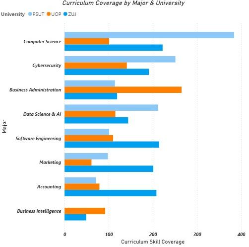
 
### Description
 
This horizontal bar chart compares curriculum skill coverage by major and university.
 
It shows the number of curriculum skills covered by each university across majors such as:
 
- Computer Science
- Cybersecurity
- Business Administration
- Data Science & AI
- Software Engineering
- Marketing
- Accounting
- Business Intelligence
 
Each university is represented with a different bar color.
 
### Insight Derived
 
The chart shows how curriculum skill coverage differs by major and university.
 
Some universities show stronger coverage in technical majors, while others show stronger coverage in business-related majors.
 
*This is important because it helps identify relative curriculum strengths by university and major. It also supports curriculum review by showing where each university has broader or weaker skill representation.*
 
This chart does not measure academic quality. It only measures the number of extracted curriculum skills from the collected documents.

This chart supports the business question:
 
> **How does curriculum skill coverage compare across different majors and universities?**
 
---
 
## Chart 5: Top Underrepresented Market Skills
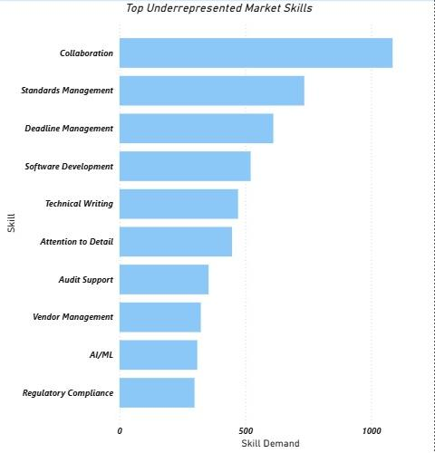
 
### Description
 
This bar chart shows market skills that appear strongly in the job market but are underrepresented or not clearly matched in the university curriculum dataset.
 
The visible skills include:
 
- Collaboration
- Standards Management
- Deadline Management
- Software Development
- Technical Writing
- Attention to Detail
- Audit Support
- Vendor Management
- AI/ML
- Regulatory Compliance
 
The x-axis shows skill demand, and the y-axis lists the skills.
 
### Insight Derived
 
The chart identifies skills that may need more attention in curriculum development or clearer representation in course descriptions.
 
Skills such as **Collaboration**, **Standards Management**, **Deadline Management**, and **Software Development** appear as important market skills.
 
*This is important because it turns the skill gap analysis into actionable curriculum improvement areas. It helps universities see which practical or professional skills are demanded by employers but may not be clearly visible in course descriptions.*

This chart supports the business question:
 
> **Which skills are frequently demanded by employers but not explicitly matched in university curricula?**
 
### Important Interpretation
 
> **Underrepresented does not always mean completely absent.**  
> It means the skill was not strongly or explicitly matched in the curriculum dataset using the current matching logic.
 
---
 
# Page 3: Job Evidence — Market Skill Demand
 
The Job Evidence page provides detailed evidence from the job market dataset. It supports the dashboard findings by showing the actual job postings and skills used in the analysis.
 
---
 
## Component 6: Job Evidence Filters

### Description
 
This page includes filters for:
 
- **Location**
- **Sector**
- **Skill**
- **Experience Level**
 
-These filters allow users to search and validate market demand by selecting a specific country, sector, skill, or experience level.
 
-The filters allow users to investigate the job market data in detail.
 
- For example, a user can filter by a specific skill such as **Accounting Principles** or **Collaboration** and see which job postings required that skill.
 
- This improves transparency and makes the analysis easier to defend because the user can verify where each market skill came from.
 
---
 
## Chart 7: Job Evidence Table
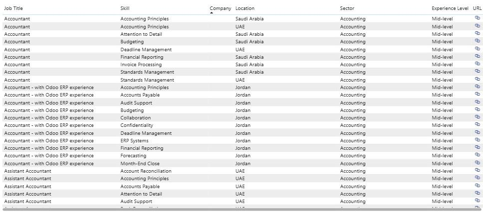
 
### Description
 
This table displays job-level evidence from the job market dataset.
 
The visible columns include:
 
- Job Title
- Skill
- Company
- Location
- Sector
- Experience Level
- URL
 
The table shows examples of job postings and the skills associated with them.
 

-This table validates the job market side of the analysis.
 
-It shows that the skills used in the dashboard are linked to real job postings, sectors, locations, and experience levels.
 
-This is important because if a viewer asks why a skill is considered demanded by the market, the dashboard can show the job evidence directly.
 
### Example
 
If the dashboard shows that **Collaboration** or **Accounting Principles** is demanded, this page can show the job postings where these skills appeared.
 
---
 
# Page 4: Course Evidence — Curriculum Skill Sources
 
The Course Evidence page provides detailed evidence from the university curriculum dataset. It shows where curriculum skills came from inside university courses.
 
---
 
## Component 8: Course Evidence Filters

 
### Description
 
This page includes filters for:
 
- **Major**
- **University**
- **Skill**
- **Course Code**
 
-These filters allow users to search for a specific curriculum skill and identify the university course where it appears.
 
-The filters support academic traceability.
 
-A user can select a specific university, major, skill, or course code to validate whether a skill appears in the curriculum dataset.
 
-This is important because it prevents the analysis from being only visual. It allows the user to trace each curriculum skill back to its course source.
 
---
 
## Chart 9: Course Evidence Table
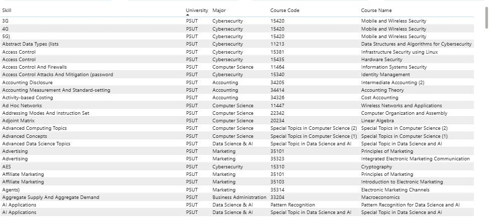
 
### Description
 
This table displays curriculum-side evidence.
 
The visible columns include:
 
- Skill
- University
- Major
- Course Code
- Course Name
 
-The table shows each extracted curriculum skill and the course where it appears.
 
-This table validates the university curriculum side of the analysis.
 
-It shows that curriculum skills are not random. Each skill is linked to a specific university, major, course code, and course name.
 
-This is important for academic defense because if a viewer asks where a curriculum skill came from, the dashboard can provide the exact course evidence.
 
### Example
 
If a skill such as **AI Applications** appears, the Course Evidence page can show the university, major, course code, and course name where it was extracted.
 
---
 
# Overall Dashboard Business Insights
 
## Insight 1: University skill coverage is larger than market skill coverage, but alignment is limited.
 
The dashboard shows around **3K university skills** compared with **186 market skills**, but only **26 matched skills**.
 
This means that universities may cover many academic skills, but not all of them directly match the specific skills requested in job postings.
 
---
 
## Insight 2: ZUJ shows the broadest curriculum skill coverage in the collected documents.
 
The Curriculum Skill Coverage by University chart shows ZUJ with the highest overall distinct curriculum skills.
 
This indicates broader curriculum skill representation in the collected source documents.
 
---
 
## Insight 3: Data Science and Business Administration represent large market demand areas.
 
The Market Demand Share by Sector treemap shows that sectors such as **Data Science** and **Business Administration** occupy large portions of the job market dataset.
 
These sectors are important when prioritizing curriculum-market alignment.
 
---
 
## Insight 4: Several practical and professional skills appear underrepresented.
 
The Top Underrepresented Market Skills chart highlights skills such as:
 
- Collaboration
- Standards Management
- Deadline Management
- Software Development
- Technical Writing
- AI/ML
 
These skills may need clearer representation in course descriptions or stronger practical integration.
 
---
 
# Advanced Analytics and AI Modeling

We applied three analytical models and one descriptive visualization to identify the gap between skills taught in university curricula and skills demanded by the MENA job market. Each figure below corresponds to a distinct method, purpose, and finding.

| Figure | Method Type | Algorithm | Key Output |
|---|---|---|---|
| Fig 01 | Descriptive Analysis | Frequency Counting | Top 25 skills ranked by frequency (both domains) |
| Fig 02 | Unsupervised ML — Clustering | K-Means + PCA | 4 distinct job market skill profiles |
| Fig 03 | Unsupervised ML — Pattern Discovery | Apriori (Association Rules) | Top 10 skill co-occurrence rules by lift |

---

## Fig 01 — Skill Frequency: University vs. Job Market
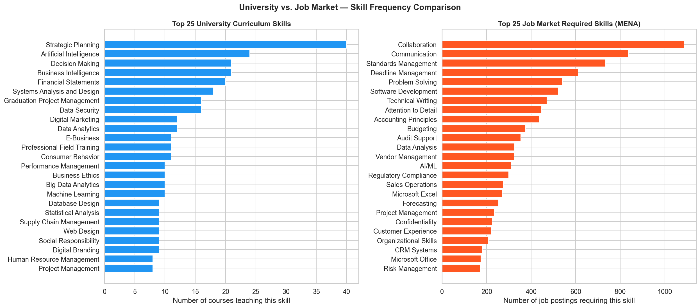
### Type
Descriptive analysis. Raw frequency counting was used to rank and compare the top 25 skills from each domain side by side.

### Tools Used

| Tool | Library | Purpose |
|---|---|---|
| `value_counts()` | `pandas` | Counted how many courses teach each university skill |
| `Counter()` | `collections` | Counted how many job postings require each skill |
| `barh()` | `matplotlib` | Rendered the two side-by-side horizontal bar charts |

### Goal
To establish a visual baseline: do the most frequently taught university skills match the most frequently demanded job market skills?

### Key Findings
The two lists are almost entirely non-overlapping:
- **Accounting Principles** dominates job postings across almost all sectors but is taught only within accounting-specific courses in university
- **ERP Systems** and **Microsoft Excel** rank among the top demanded job skills but receive minimal dedicated coverage in university curricula
- University skills skew theoretical (e.g., *Financial Statement Analysis*, *Accounting Theory*), while job market skills are practical and cross-functional (e.g., *Attention to Detail*, *Collaboration*, *ERP Systems*)

---

## Fig 02 — K-Means Job Clustering

### Type
Unsupervised Machine Learning — Clustering, with PCA for 2D visualization.

### Tools Used

| Component | Library | Purpose |
|---|---|---|
| `TfidfVectorizer` | `sklearn.feature_extraction.text` | Converted each job posting's skill list into a numerical vector |
| `KMeans` | `sklearn.cluster` | Grouped job postings into 4 clusters by skill-profile similarity |
| `PCA` | `sklearn.decomposition` | Compressed 200 dimensions down to 2 for scatter plot visualization |

### Parameters

| Parameter | Value | Reason |
|---|---|---|
| `n_clusters` | 4 | Chosen to produce interpretable, distinct profiles |
| `n_init` | 10 | Runs 10 initializations and keeps the best — prevents unstable clustering |
| `random_state` | 42 | Reproducibility |
| `max_features` | 200 | Caps TF-IDF vocabulary to the 200 most informative skill terms |
| `min_df` | 2 | Excludes skills appearing in only one posting (noise reduction) |
| PCA components | 2 | Minimum needed for 2D plotting |
| PCA variance captured | ~12.5% | Proportion of total skill variation visible in the 2D plot |

### Goal
To discover whether MENA job postings naturally segment into distinct skill profiles — and if so, what those profiles look like. This determines whether a single curriculum can serve all graduates or whether sector-specific gaps must be addressed separately.

### Cluster Results

| Cluster | Label | Defining Skills |
|---|---|---|
| 1 | Core Finance & Accounting | Accounting Principles, ERP Systems, VAT, Audit |
| 2 | Tech & Engineering | Python, Software Development, Data Analysis |
| 3 | Sales & Commercial | CRM, Sales Operations, Customer Experience |
| 4 | Business & Compliance | Risk Management, Regulatory Compliance, Collaboration |

Cluster labels were assigned automatically: the top 3 TF-IDF terms per cluster centroid were extracted and mapped to a label via keyword matching.

### Key Finding
The MENA job market naturally organizes into four distinct skill profiles, three of which are business-oriented and one technical. This reflects the nature of the dataset which covers 8 sectors including Accounting, Business Administration, Business Intelligence, E-Marketing, Data Science, Cybersecurity, Software Engineering, and Computer Science. A one-size-fits-all curriculum is structurally misaligned with at least three of the four segments a graduate might enter.

---

## Fig 03 — Skill Co-occurrence: Association Rule Mining
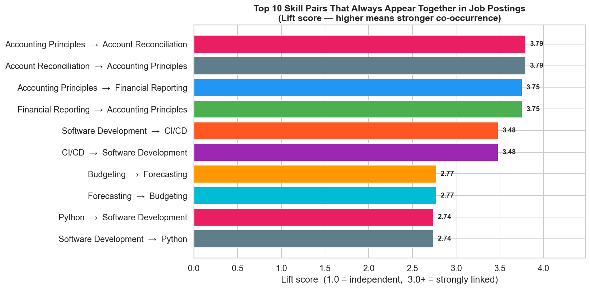
### Type
Unsupervised Machine Learning — Association Rule Learning, adapted from market basket analysis to skill co-occurrence in job postings.

### Tools Used

| Component | Library | Purpose |
|---|---|---|
| `TransactionEncoder` | `mlxtend.preprocessing` | Converted skill lists into a binary matrix (1 = skill present, 0 = absent) |
| `apriori` | `mlxtend.frequent_patterns` | Identified all skill combinations meeting the minimum support threshold |
| `association_rules` | `mlxtend.frequent_patterns` | Generated directional rules ranked by lift score |

### Parameters

| Parameter | Value | Meaning |
|---|---|---|
| `min_support` | 0.05 | Skill pair must appear together in ≥ 5% of all job postings |
| `min_threshold` (lift) | 1.2 | Only rules where co-occurrence is ≥ 20% above chance are kept |
| Top rules displayed | 10 | Sorted descending by lift |

### Metrics Explained

| Metric | Formula | Interpretation |
|---|---|---|
| Support | P(A ∩ B) | How common the pair is across all postings |
| Confidence | P(B\|A) | If a posting requires A, how likely it also requires B |
| Lift | P(A ∩ B) / (P(A) × P(B)) | How much more likely the pair appears together vs. by chance. Lift = 1.0 → independent; Lift > 2.0 → strongly linked |

### Goal
To reveal which skills employers treat as a bundle rather than individual requirements — shifting the curriculum recommendation from "add these skills" to "teach these skills together."

### Key Finding
Employers think in skill bundles, not isolated competencies. A student missing one skill from a bundle fails to qualify for the role even if they possess the others. Curriculum gaps are therefore compounding, not additive.
---
## Tools Research and Selection Effort


### What tools did we evaluate?

During the planning phase, we evaluated multiple tools across four categories: data collection, data analysis, visualization, and deployment.

**Data Collection:**
- **Selenium (Python)** vs. **Scrapy** vs. **BeautifulSoup** — all three are Python-based web scraping options. Scrapy is faster for large-scale crawls but requires more setup. BeautifulSoup handles static HTML well but cannot interact with JavaScript-rendered pages. **Selenium** was the only option capable of simulating real browser behavior, which was required to navigate Bayt.com's dynamically loaded job listings.

**Data Analysis:**
- **Python** vs. **R** — both are standard languages for data analysis. R is stronger for statistical modeling and academic research, but Python offers a broader ecosystem for combining web scraping, ML, and visualization in a single pipeline. Since this project required all three in sequence, **Python** was the clear choice.

**Visualization:**
- **Power BI** vs. **Tableau** vs. **Looker** — all three are enterprise-grade BI platforms. Tableau offers superior design flexibility, and Looker integrates well with cloud databases. However, **Power BI** was selected because it is the most widely adopted tool in the MENA region's business and public sector, it integrates directly with Excel, and it was the most accessible option given the academic licensing available to the team. Looker was excluded due to its cloud-dependency and cost. Tableau was evaluated seriously but deprioritized because Power BI's data modeling features (relationships, DAX measures) were better suited to linking two separate datasets — the university and job market tables.
- **Matplotlib** was evaluated for static Python charts and was ultimately retained for the advanced analytics figures (K-Means, Apriori, lift scoring), where custom visual control was needed that Power BI's built-in charts could not easily replicate.

**Deployment / Presentation:**
- **Streamlit** vs. **Gradio** vs. **Flask** vs. **Power BI Service** — Streamlit and Gradio are both Python-based frameworks for building quick interactive web apps. Flask offers more control but requires front-end development. **Power BI** Service allows direct publishing of Power BI dashboards to the web without additional infrastructure.

---

### Which tools did we ultimately choose?

| Category | Tool Selected |
|---|---|
| Web Scraping | Python + Selenium WebDriver |
| Data Cleaning & Analysis | Python (pandas, collections, sklearn, mlxtend) |
| Advanced ML Models | Python (scikit-learn, mlxtend) |
| Static Visualizations | Python (matplotlib) |
| Interactive Dashboard | Microsoft Power BI Desktop |
| Dashboard Publishing | Power BI Service (web publishing) |
| Document Processing | iLovePDF |
| AI-Assisted Extraction | Claude (Anthropic) — LLM extraction pipeline |
| Data Storage | Microsoft Excel (.xlsx) |

---

### Why did we select these tools?

**Python + Selenium** was selected because Bayt.com renders job listings dynamically using JavaScript, and only a real-browser automation tool could reliably navigate search results, open individual job pages, and extract full descriptions. Random delays and User-Agent spoofing were implemented within the Selenium script to ensure stable, uninterrupted data collection across 2,000 postings.

**Python (pandas, sklearn, mlxtend)** was selected because the entire analysis pipeline — from raw scraping output to skill normalization, frequency counting, K-Means clustering, Apriori mining, and lift scoring — could be written and reproduced in a single environment. This reduced data transfer errors between tools and kept the analysis traceable end-to-end.

**Power BI** was selected for the interactive dashboard because it supports multi-table data models, custom DAX measures for computing gap percentages, and slicers that allow non-technical users (university administrators, career advisors) to explore the data without writing code. Its native Excel integration made loading the cleaned `.xlsx` datasets straightforward.

**Claude (Anthropic LLM)** was selected as an extraction assistant for both the university curriculum dataset and the job description skills pipeline. Its role was strictly parsing and normalization — reading source text and extracting only explicitly stated or clearly implied skills — not generating new content. This choice was made because rule-based extraction (regex) could not handle the linguistic variation in 2,000 free-text job descriptions at acceptable accuracy.

**Microsoft Excel** was selected as the storage format because it is universally readable, directly importable into Power BI, and accessible to all project stakeholders without requiring database infrastructure.

---

### How do these tools support the project?

Each tool plays a distinct, non-overlapping role in the pipeline:

1. **Selenium** fills the data acquisition layer — no other tool in the evaluation could reliably scrape Bayt.com at scale.
2. **Python / pandas** handles all cleaning, normalization, deduplication, and the synonym dictionary matching that links job market skills to curriculum equivalents.
3. **scikit-learn and mlxtend** power the three advanced models (K-Means clustering, Apriori association rules, lift-score ranking) that move the analysis beyond simple frequency counts into pattern discovery.
4. **matplotlib** generates publication-ready static figures (Fig 01–04) that are embedded directly in this documentation and the project report.
5. **Power BI** delivers the interactive, filter-driven dashboard that is the project's primary business deliverable — allowing stakeholders to drill down by university, major, country, and sector without touching the underlying data.
6. **Claude** compresses what would have been weeks of manual extraction into a consistent, auditable, prompt-driven pipeline that maintains source traceability at every step.

---

## Project Deployment Effort – Use Case

### How will a business user consume this project?

The primary deliverable is an **interactive Power BI dashboard** published via Power BI Service. This format was chosen because the target users — university curriculum committees, academic advisors, department heads, and career services staff — are not technical users and require a point-and-click interface rather than code or raw data files.

The dashboard supports the following consumption patterns:

- **Curriculum committees** use the Skills Gap Analysis page to identify which skills are most underrepresented in their specific university and major, filtered interactively.
- **Students and academic advisors** use the Executive Overview KPI cards and sector treemap to understand which sectors have the highest demand and where curriculum-to-market alignment is strongest.
- **Employers and recruitment teams** use the Job Evidence page to verify which skills drove the analysis and filter by country, sector, and experience level.
- **Researchers and accreditation bodies** use the Course Evidence page to trace every curriculum skill back to its originating university, major, course code, and course name — providing full academic traceability.


---

### Implementation Steps in Chronological Order

**Phase 1 — Problem Scoping and Data Planning**

1. Define eight target academic majors spanning IT and Business.

2. Identify three universities (UOP, PSUT, ZUJ) with comparable program offerings.

3. Expand geographic scope from Jordan-only to MENA (UAE, KSA, Egypt, Jordan) after confirming insufficient job volume from Jordan alone.

4. Select Bayt.com as the single scraping source after evaluating Akhtaboot and Kalamantina and Linkedin.


**Phase 2 — Data Collection**

5. Build and test the Selenium scraper across all four countries and eight sector keyword sets.

6. Run Phase 1 scraping (listing cards) across 78 job-title keywords, up to 10 pages per keyword per country.

7. Run Phase 2 scraping (full job descriptions) by opening each individual job URL.

8. Export all records to Excel with checkpoint saves every 100 records.

9. Manually download PDF curriculum documents from UOP, PSUT, and ZUJ official websites (~27 PDF files total).

10. Organize PDFs by university; convert to text using iLovePDF where needed.


**Phase 3 — Data Cleaning and Transformation**

11. Apply the LLM-assisted extraction prompt to all university course descriptions to produce structured skill records (University, Major, Course Code, Course Name, Skill).

12. Apply the LLM-assisted extraction pipeline to all 2,000 job descriptions to produce a normalized Skills column.

13. Normalize skill names in both datasets using a synonym dictionary in power bi.

14. Standardize country names, date formats, and experience level categories in the job dataset.

15. Clean deduplicate job postings by URL.

16. Validate missing values across all fields in both datasets.


**Phase 4 — Analysis and Modeling**.

17. Run Fig 01 (frequency analysis) to establish the baseline skill comparison.

18. Run Fig 02 (K-Means clustering with PCA) to segment the job market into four skill profiles.

19. Run Fig 03 (Apriori association rule mining) to identify skill co-occurrence bundles.

20. Generate all four figures as static matplotlib exports.


**Phase 5 — Dashboard Development**

21. Load the cleaned university and job datasets into Power BI Desktop.

22. Build the data model: define relationships between tables on shared keys (Major/Sector, University).

23. Create DAX measures for Gap %, Matched Skills.

24. Design and build all four dashboard pages: Executive Overview, Skills Gap Analysis, Job Evidence, Course Evidence.

25. Add slicers for Location, University, Sector, Major, Skill, Experience Level, and Course Code.

26. Apply consistent color theme and layout across all pages.


**Phase 6 — Publishing and Delivery**

27. Publish the Power BI report to Power BI Service.

28. Generate a shareable dashboard link for academic submission and stakeholder review.

29. Finalize this documentation report with embedded figures, data dictionaries, and section references.


---

### Infrastructure and Hosting Considerations

| Component | Infrastructure | Notes |
|---|---|---|
| Scraping runtime | Local machine (Windows) | Selenium requires a local browser instance; no cloud compute was needed |
| Data storage | Local Excel files (.xlsx) | No database server required; file size remained under 50 MB |
| Python analysis | Local Jupyter / script environment | All ML models run on CPU; no GPU required |
| Power BI Desktop | Local installation | Free academic license; used for all dashboard development |
| Power BI Service | Microsoft cloud (free tier) | Dashboard published for sharing; no custom domain or server required |
| Version control | GitHub repository | All scripts, datasets, and documentation stored and versioned |

---
## Results

### Summary of Findings

This project set out to answer one central question: **how well do the curricula of three Jordanian private universities align with what MENA employers actually demand?** The answer, across all eight majors and all three universities, is: **not well enough**. Despite the three universities collectively offering 1,145 curriculum skill records across 506 courses, only 63 skills were matched against the 186 distinct skills identified across 2,000 real MENA job postings using dictionary-based mapping — producing a Dictionary Gap of 66%, with 123 market skills remaining unmatched. This is not primarily a volume problem. Universities are not teaching too few things; they are teaching the right concepts under the wrong labels and without the industry-specific tools that employers treat as non-negotiable entry requirements.

The most critical gaps are concentrated in three areas that cut across nearly every sector. First, AI/Machine Learning and Cloud Computing (AWS/Azure) appear in hundreds of job postings but are either absent from or severely underrepresented in all three university curricula. Second, ERP systems — SAP, Oracle, and Microsoft Dynamics combined — appear in over 400 job postings, making them the single most demanded technical skill cluster in the dataset, yet none of the three universities teaches them by their market name. Third, professional and cross-functional skills such as Agile/Scrum, CI/CD, and regulatory compliance frameworks appear across all technical sectors but have no direct curriculum equivalent in any of the surveyed programs.

At the university level, PSUT shows the strongest alignment in its technology-focused programs, reflecting its technology specialization. University of Petra demonstrates stronger performance in Business Intelligence, Data Science & AI, and Marketing. Al-Zaytoonah leads in curriculum breadth and Accounting coverage. However, no university achieves a strong skill match across all eight majors simultaneously. The gap is systemic, not isolated.

---

### Most Important Insights and Charts

**The Skills Gap Analysis page** is the single most important visualization in this project. It condenses the entire curriculum-to-market comparison into one actionable view, showing — at a glance — which market skills remain unmatched after dictionary-based mapping and how large the gap is. The finding that Communication (832 postings), Problem Solving (540), and Data Analysis (325) remain among the top unmatched skills despite being teachable competencies is among the most actionable findings.

**Fig 01 (Skill Frequency Comparison)** is the most accessible insight for non-technical audiences. The side-by-side view of university teaching frequency versus job market demand frequency makes the mismatch immediately visible without any statistical background: Microsoft Excel is among the most demanded skills in the market and barely appears in any course; theoretical accounting subjects dominate university curricula while practical cross-functional skills dominate job postings.

**Fig 03 (Association Rules)** is the most actionable chart for curriculum reform. Rather than listing all missing skills, it reveals which skills employers consistently require together — meaning a graduate missing one skill in a bundle fails to qualify for the role even if they possess the others.

---

### Evaluation and Interpretation of Results

The 66% gap figure should be interpreted carefully. It does not mean that 66% of what employers need is completely absent from university classrooms. A significant portion of the gap is a **terminology mismatch**: universities teach financial statement preparation; employers list "Financial Reporting." Universities teach enterprise systems concepts; employers list "SAP" or "Oracle." The synonym dictionary built for this project already corrected for 54 common cases, but the underlying academic language still differs substantially from industry shorthand. If terminology were fully harmonized, the match rate would be meaningfully higher — though the genuine absence of tool-specific and emerging-technology training would still leave a substantial gap.

The K-Means clustering result (Fig 02) is particularly relevant to interpretation: the MENA job market segments into four distinct skill profiles (Core Finance & Accounting, Tech & Engineering, Sales & Commercial, Business & Compliance), and a single curriculum cannot align with all four simultaneously. This means the 66% gap is not a single gap — it is four different gaps depending on which career path a graduate pursues. Curriculum reform should therefore be differentiated by major track, not applied uniformly.

The Apriori association rule finding (Fig 03) adds a compounding dimension: employers evaluate skill bundles, not individual skills. A graduate who learns Accounting Principles but not ERP Systems fails to qualify for roles that require both — even if they are otherwise well-prepared. This means curriculum gaps have a multiplier effect: a missing skill in a co-occurrence bundle effectively invalidates the other skills in that bundle for the roles that require the full set.

---

### Business Impact and Recommendations

**For university curriculum committees:**
The most immediate, highest-impact change across all three universities is the integration of named industry tools into existing courses. Adding SAP or Oracle demonstrations into Enterprise Systems courses, incorporating AWS or Azure labs into Cloud or Networking courses, and teaching Python and SQL within existing data analysis courses would close a large portion of the terminology gap without requiring new course creation. These are changes that can be implemented within a single semester update cycle.

**For Data Science and AI programs specifically:**
All three universities need urgent curriculum updates in this area. The sector has the highest job posting volume in the dataset (348 jobs) and among the lowest curriculum coverage scores. MLOps, Feature Engineering, and Deep Learning are not niche specializations — they are the baseline technical vocabulary of the field as it exists in the MENA market today. A dedicated practical ML pipeline course covering model deployment, not just model training, would address the most critical gap in this sector.

**For Cybersecurity programs:**
Cloud security, risk management frameworks, and networking tools are sector-defining skills with high demand and low curriculum presence. These topics are mature enough to be standardized into curricula and are covered by widely available frameworks (NIST, CompTIA, SANS) that universities could adopt as reference syllabi.

**For students and career advisors:**
Students in any of the eight programs should treat the underrepresented skills identified in this project as a self-study roadmap. The skills most likely to close the employability gap — Microsoft Excel, Python, SQL, and at least one cloud platform — are all available through free or low-cost online certifications. A structured self-development plan targeting these skills alongside the university curriculum would substantially improve a graduate's market readiness without waiting for institutional reform.

**For employers recruiting Jordanian graduates:**
The data confirms that Jordanian graduates arrive with strong conceptual foundations — particularly in accounting principles, software engineering theory, and business administration frameworks — but limited exposure to the named tools and cross-functional practices that define day-to-day work in the region. Structured onboarding programs that bridge tool-specific skills (ERP, cloud platforms, BI tools) are likely to yield faster productivity than programs that reteach conceptual foundations.

**Scalability of this approach:**
The data pipeline built for this project — scraping, LLM-assisted extraction, synonym normalization, and Power BI visualization — is repeatable. Running it annually would allow universities to track whether curriculum reforms are closing the gap over time, creating a feedback loop between education and employment that currently does not exist in the Jordanian higher education system.
### Recommendations from Student Questionnaire

(https://docs.google.com/forms/d/e/1FAIpQLSdYpr_gesA6oSDuWqPn9NoeB0P1NXGCgPm_vsk-PeI9HDyR1A/viewform?usp=sharing&ouid=100248281304024658561)
The following recommendations emerge specifically from the student 
questionnaire data and complement the findings above by adding 
ground-level evidence. Where overlap exists with the job market 
recommendations, the questionnaire data serves as independent 
confirmation from the student perspective.

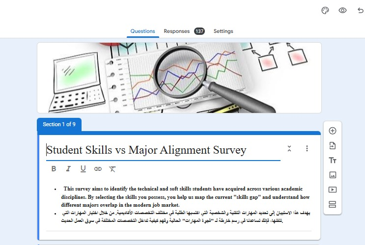

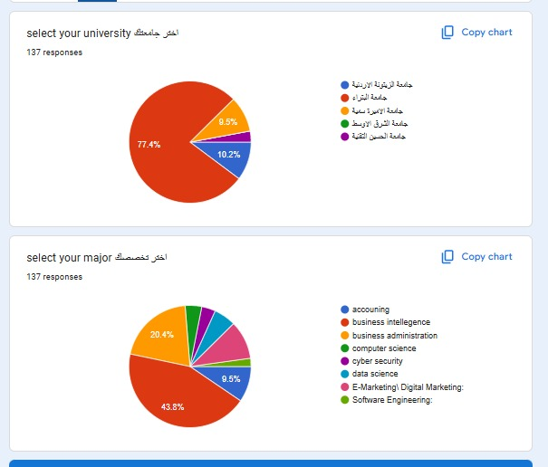

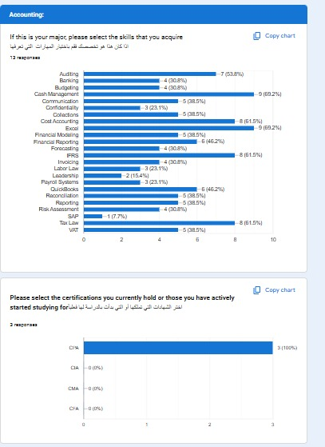


**1. Universities should publish a clean, updated skill list for every 
course — every semester**

The curriculum data collected from university websites contained 
significant noise — approximately 14% of extracted content consisted of 
full sentences rather than discrete skills, such as "Upon Completion Of 
This Course" or "These Include Methods To Approximate Roots Of Functions." 
Additionally, no curriculum document carried a timestamp, making it 
impossible to determine when the content was last updated. Universities 
should introduce a structured "Skills Taught" field on every course page, 
listing plain comma-separated skill names with no full sentences, and 
commit to refreshing it at the start of each semester. This single 
structural change would make future curriculum-to-market analysis 
significantly faster and more accurate, eliminating the months of manual 
cleaning required in this project.

**2. Soft skills need to be embedded into every programme, not treated 
as secondary**

Across 2,000 MENA job postings, Collaboration appears 1,085 times, 
Communication 832 times, Deadline Management 611 times, and Problem 
Solving 540 times — making them the four most demanded skills in the 
entire dataset. None of these appear explicitly in any of the three 
universities' curricula, and only 19 questionnaire respondents reported 
Communication as a self-developed skill. Every major should incorporate 
project-based assessments that require real teamwork, written technical 
reports, and stakeholder presentations. A structured final-year capstone 
that simulates an actual workplace environment — with enforced deadlines, 
formal presentations, and cross-functional collaboration — would address 
this gap systematically across all eight majors at once.

**3. Certifications should be structured into the programme, not left 
as a private student initiative**

Questionnaire responses revealed that 39 students hold Power BI 
certification, 20 hold Tableau, 13 hold PMP, 4 hold CompTIA Security+, 
and 3 hold CPA — yet none of these certifications are mentioned, 
encouraged, or formally integrated into any curriculum at the three 
universities. Universities should map relevant industry certifications 
to each major, negotiate bulk exam pricing with providers such as 
Microsoft, Tableau, and CompTIA, and offer elective credit to students 
who pass them during their degree. The questionnaire data confirms that 
students are already pursuing these certifications independently — the 
institution simply needs to formalise and support what students are 
already doing on their own.

---

## References

Al-Zaytoonah University of Jordan.  *Faculty programs and course descriptions*. Retrieved from https://www.zuj.edu.jo

Princess Sumaya University for Technology. *Academic programs and course catalog*. Retrieved from https://www.psut.edu.jo

University of Petra.  *Course catalog and study plans*. Retrieved from https://www.uop.edu.jo

Bayt.com. (2026). *MENA job postings database*. Retrieved March–April 2026 from https://www.bayt.com

MacQueen, J. (1967). Some methods for classification and analysis of multivariate observations. *Proceedings of the 5th Berkeley Symposium on Mathematical Statistics and Probability*, 1, 281–297.

Pedregosa, F., Varoquaux, G., Gramfort, A., Michel, V., Thirion, B., Grisel, O., Blondel, M., Prettenhofer, P., Weiss, R., Dubourg, V., Vanderplas, J., Passos, A., Cournapeau, D., Brucher, M., Perrot, M., & Duchesnay, E. (2011). Scikit-learn: Machine learning in Python. *Journal of Machine Learning Research*, 12, 2825–2830.

Raschka, S. (2018). MLxtend: Providing machine learning and data science utilities and extensions to Python's scientific computing stack. *Journal of Open Source Software*, 3(24), 638.

World Economic Forum. (2023). *Future of jobs report 2023*. World Economic Forum. https://www.weforum.org/reports/the-future-of-jobs-report-2023


